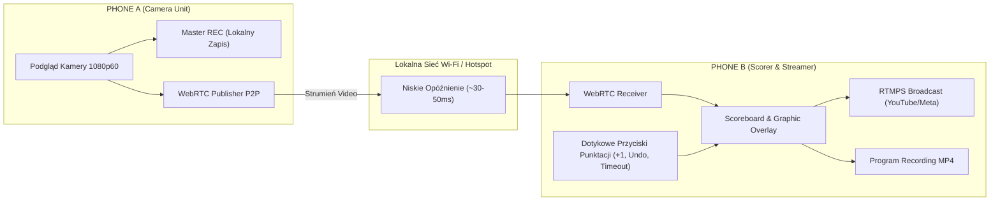

# Specyfikacja UI/UX i Zrzuty Ekranów — VolleyLive Analytics (MVP)

Niniejszy dokument przedstawia kompletny projekt interfejsu użytkownika (UI) oraz zasady doświadczenia użytkownika (UX) dla systemu dwóch urządzeń zgodnie z wymaganiami technicznymi i funkcjonalnymi zawartymi w [WSAD.md](file:///c:/Users/kusoj/Desktop/Projekty/GoGoShawk/CameraMobile4Sport/WSAD.md).

---

## 1. Koncepcja Architektury UI / UX

System opiera się na żelaznym podziale ról pomiędzy dwa smartfony:
- **PHONE A (Camera Device)** → Zasada **„USTAW I ZOSTAW”** (*Set and Forget*): Telefon zamontowany na statywie, zoptymalizowany pod kątem stabilności, niskiego zużycia energii i ciągłości nagrywania (*Offline Master REC*).
- **PHONE B (Scorer & Streamer)** → Zasada **„STERUJ MECZEM”** (*Control the Match*): Reżyserka meczowa, duże haptyczne przyciski punktacji (+1), sterowanie rotacją, timeoutem, nakładanie nakładki transmisyjnej (*Scoreboard Overlay*) i nadawanie RTMPS na żywo (YouTube/Facebook/RTMP).



---

## 2. Zrzuty UI — Kluczowe Ekrany Aplikacji

````carousel

<!-- slide -->

<!-- slide -->

<!-- slide -->

````

---

## 3. Szczegółowy Opis Poszczególnych Ekranów

### 3.1. Ekran Główny Scorera & Streamera (PHONE B)
Główny pulpit osoby sędziującej i realizującej transmisję. Zapewnia pełny podgląd meczu z nałożoną grafiką telewizyjną oraz ergonomiczny panel dotykowy.

* **Pasek Statusu Transmisji (Top HUD):**
  - `🔴 LIVE`: Wskaźnik nadawania (Platforma YouTube RTMPS, 1080p 60fps, 8.2 Mbps, Bitrate Health).
  - `⏺️ REC`: Status nagrywania programowego z grafiką.
  - `📡 Camera Link`: Stan połączenia z PHONE A przez WebRTC (Opóźnienie: 35 ms, stabilność sygnału, bateria telefonu-kamery).
* **Obszar Podglądu Wideo (Video Viewport):**
  - Wyświetlanie strumienia z PHONE A w czasie rzeczywistym.
  - **Dynamic Scoreboard Overlay**: Nazwy drużyn (*AZS Kraków* vs *Legia Warszawa*), bieżące punkty w secie (21 : 19), wynik w setach (1 : 1), numer seta (Set 3), wskaźnik zagrywki (Serve dot/arrow), czas trwania seta.
* **Panel Punktacji (Scoring Tactile Deck):**
  - **Super-duże przyciski `+1 TEAM A` oraz `+1 TEAM B`**: Zaprojektowane do obsługi jednym kciukiem bez konieczności precyzyjnego celowania.
  - **Przycisk `UNDO`**: Bezpieczne cofanie ostatniej akcji w oparciu o silnik zdarzeń `ScoreEvent`.
  - **Przycisk `TIMEOUT (30s)`**: Wyświetlenie odliczania czasu dla przerwy taktycznej i nałożenie baneru na transmisję.
  - **Przycisk `ROTATION`**: Zmiana ustawienia zawodników i pozycji zagrywającego.
  - **Dolna nawigacja**: Szybki dostęp do *Scorer*, *Stats*, *Stream*, *Matches*, *Settings*.

---

### 3.2. Ekran Kamery (PHONE A)
Dedykowany dla telefonu montowanego na statywie przy boisku.

* **Top Overlay (Bezpieczeństwo & Telemetria):**
  - `MASTER REC: 00:42:15`: Niezależny, sprzętowy zapis wideo 1080p60 w pamięci lokalnej (odporny na zerwanie Wi-Fi lub awarię PHONE B).
  - `WebRTC LINK`: Identyfikator sesji P2P, stan transmisji do PHONE B.
  - Stan naładowania baterii, wskaźnik termiczny (*Thermal Throttle Guard*).
* **Dolny Pasek Narzędziowy:**
  - **Wskaźnik audio (VU Meter)**: Monitorowanie poziomu mikrofonu stereo hali.
  - **Przełącznik obiektywów**: Ultraszeroki `0.5x`, standardowy `1x`, tele `2x`/`3x`.
  - **Duży przycisk REC / PAUSE**: Ręczny start/stop lokalnego masteringu.
  - **Blokada ekspozycji i ostrości (AE/AF Lock)**: Zapobiega pompowaniu jasności przy dynamicznym ruchu piłki.
  - **Przycisk `LOCK SCREEN & TRIPOD MODE`**: Wygaszenie podświetlenia ekranu i zablokowanie dotyku (ochrona baterii i zabezpieczenie przed przypadkowym dotknięciem).

---

### 3.3. Proces Parowania (Quick Pairing via QR / P2P)
Wyeliminowanie konieczności ręcznego wpisywania adresów IP w hali sportowej.

1. **PHONE B (Tworzenie meczu):**
   - Wybór dyscypliny: *Siatkówka (Volleyball)*.
   - Wprowadzenie nazw zespołów i kolorów strojów.
   - Wygenerowanie kodu QR oraz 6-znakowego PINu awaryjnego (np. `VL-8492`).
   - Uruchomienie lokalnego nasłuchu mDNS / WebSocket Signaling w sieci Wi-Fi lub Hotspotcie PHONE B.
2. **PHONE A (Dołączenie):**
   - Wybór trybu *CAMERA*.
   - Zeskanowanie kodu QR wizjerem kamery.
   - Błyskawiczny uścisk dłoni WebRTC SDP/ICE.
   - Potwierdzenie zielonym komunikatem: `P2P WebRTC Connected` i przejście w tryb kamery.

---

### 3.4. Modal Konfiguracji Transmisji i Nakładek (PHONE B)
Pełna kontrola nad parametrami wyjściowymi oraz bezpieczeństwem poświadczeń.

* **Bezpieczeństwo Transmisji (Broadcast Ingest):**
  - Wybór celu: `YouTube Live (RTMPS)`, `Meta / Facebook`, `Generic RTMPS`.
  - Serwer URL: `rtmps://...`
  - Klucz strumienia: Pole maskowane z oznaczeniem `Stored in Secure Hardware Storage` (zapis wyłącznie w *Android Keystore* / *iOS Keychain*, brak zapisu w plaintext).
  - Jakość kodera: 1080p 60fps / 8.0 Mbps CBR H.264 + AAC 160 kbps.
  - Przełącznik *Local Program Recording (MP4)*.
* **Studio Nakładek (Scoreboard Studio):**
  - Podgląd na żywo miniatury belki wynikowej.
  - Style motywu: *TV Pro Broadcast*, *Minimalist Clean*, *Cyber Glow*.
  - Próbnik kolorów zespołów (Primary / Secondary color).
  - Wskaźnik zagrywki: Kropka (*Dot*) lub Strzałka (*Arrow*).
  - Odliczanie czasu przerw (Timeout display toggle).

---

## 4. Stany Awaryjne i Obsługa Błędów (Failure & Recovery UX)

Zgodnie z wymaganiami [WSAD.md](file:///c:/Users/kusoj/Desktop/Projekty/GoGoShawk/CameraMobile4Sport/WSAD.md), interfejs użytkownika w czytelny i bezstresowy sposób komunikuje awarie:

| Scenariusz Awarii | Reakcja UI na PHONE A | Reakcja UI na PHONE B |
| :--- | :--- | :--- |
| **Utrata połączenia Wi-Fi / WebRTC** | `MASTER REC CONTINUES` (Niebieski/czerwony pulsujący badge). Zero przerw w nagraniu. | Komunikat: `CAMERA LINK LOST - RECONNECTING...`. Wynik pozostaje zablokowany, transmisja może wysyłać planszę pauzy. |
| **Utrata Internetu w hali** | Brak wpływu (urządzenie działa w sieci lokalnej). | Zatrzymanie `LIVE STREAM`, komunikat: `INTERNET OFFLINE - LOCAL REC & SCORING ACTIVE`. |
| **Brak klucza streamingu** | Brak wpływu. | Czerwona walidacja: `Configuration Error: Stream Key Missing in Secure Storage`. |
| **Przegrzewanie urządzenia** | Automatyczne obniżenie jasności ekranu do 10% i ostrzeżenie `Thermal Guard Active`. | Komunikat ostrzegawczy o kondycji baterii kamery. |

---

## 5. Zgodność z Wytycznymi Projektu

> [!IMPORTANT]
> Wszystkie zrzuty i projekty UI spełniają kluczowe zasady:
> 1. **Brak przeładowania ekranu funkcjami analitycznymi / CV** w fazie MVP Lite.
> 2. **Odporność na błędy** dzięki architekturze *Offline-First* i ciągłemu *Master Recording*.
> 3. **Ergonomia meczowa** – duże dotykowe przyciski dla sędziego stolikowego.
> 4. **Bezpieczeństwo danych** – brak haseł i kluczy w kodzie czy logach.
